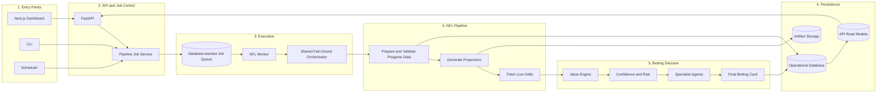

# NFL Pipeline Architecture

The application separates request handling from long-running NFL model execution. FastAPI
creates durable jobs and reads materialized results; a dedicated worker owns the fail-closed
pipeline.



## Runtime contract

- Pipeline reads require an authenticated session; mutations require an `operator`/`admin`
  subscription tier or the server-side `PIPELINE_CONTROL_TOKEN`.
- `POST /api/run` validates and enqueues a principal-scoped, payload-bound idempotent job; it
  never starts a model thread in FastAPI.
- `pipeline_jobs.worker` atomically claims one available job and records worker ownership,
  renewable heartbeat leases, attempts, stage status, results, and errors. Expired leases are
  reclaimed within the retry budget and stale workers are fenced from terminal writes.
- Failures retry with bounded exponential backoff only when every executed stage declares its
  effects retry-safe. Terminal or unproven failures require an explicit operator retry.
- Cancellation is immediate for queued jobs and cooperative between running stages. Lease loss
  additionally hard-stops the worker process so a non-cooperative handler cannot keep executing.
- Live-odds failure stops the pipeline before value, risk, agents, or materialization can use a
  stale card.
- CLI and scheduler call the same `JobService` used by the API.
- Run reports are registered in `pipeline_artifacts`; dashboard queries read persisted run,
  stage, decision, and materialized-card state.

## Commands

```bash
# Apply schema migrations before starting services
make api-preflight

# API and worker as separate local processes
make api-serve
make pipeline-worker

# Queue a weekly production run
make production-run SEASON=2026 WEEK=1

# Process one queued job for local verification
make pipeline-worker-once
```

The container entrypoint applies migrations, then supervises FastAPI and the worker as separate
OS processes. Set
`ENABLE_PIPELINE_SCHEDULER=true` to also run the scheduler process. SQLite/WAL remains the local
backend; the existing production database abstraction can also use MySQL. The private NFL model
adapter and private FastAPI server remain deployment-supplied modules per repository policy.
