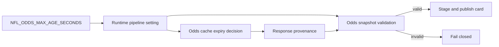
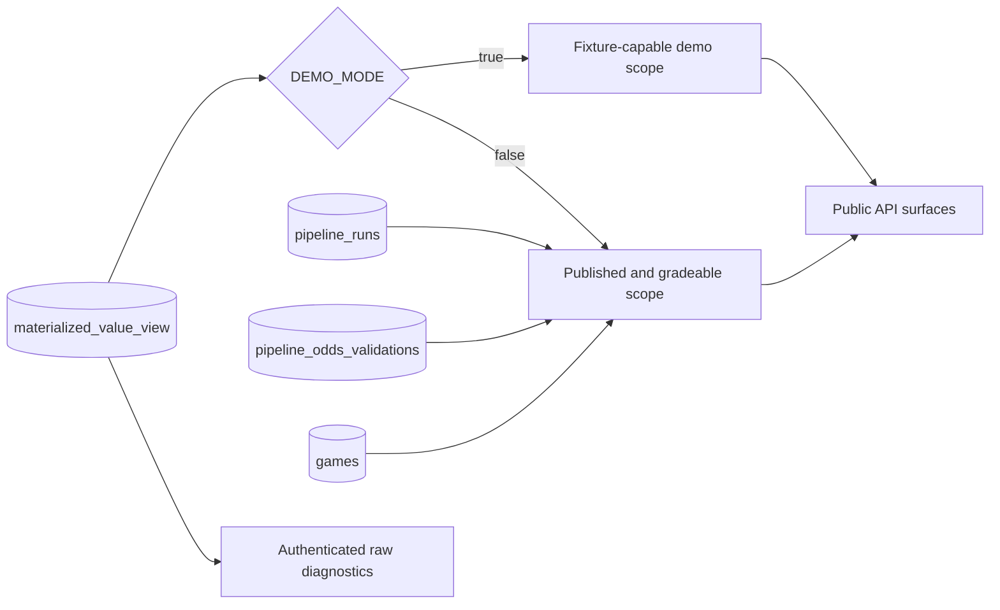
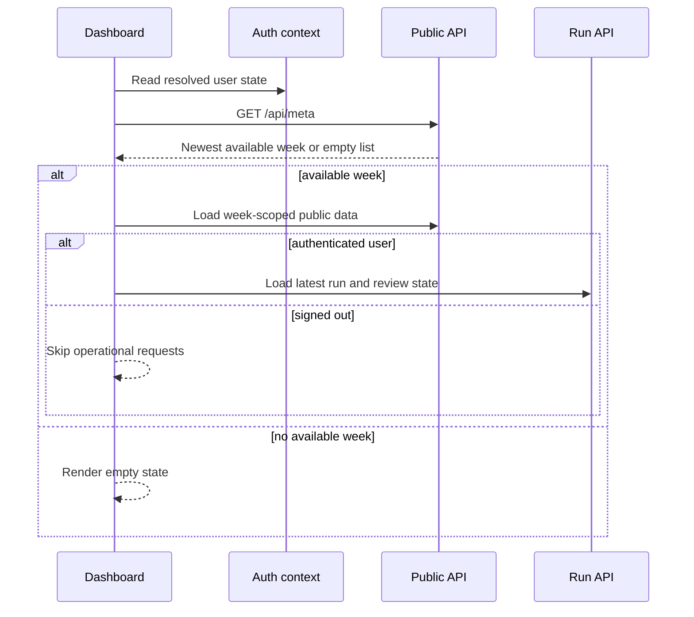
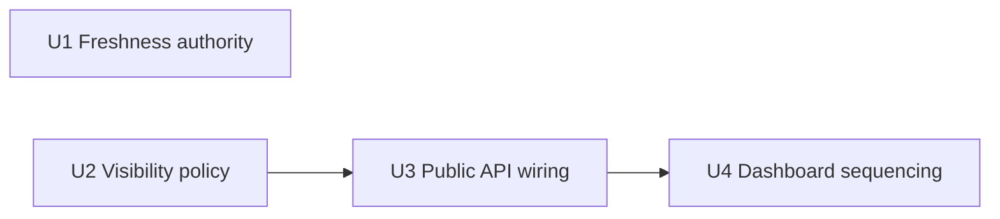

# Season Readiness Data Wiring - Plan

## Goal Capsule

Make the NFL dashboard safe to use before the season by aligning odds-cache reuse with the live-odds freshness gate, limiting public value data to legitimate published cards unless demo mode is explicit, and preventing dashboard requests for a stale default week or an authenticated run endpoint when no user is signed in.

Authority order:

1. The Product Contract in this plan defines user-visible behavior.
2. The durable pipeline publication contract in `pipeline_jobs/service.py` and `pipeline_jobs/cards.py` defines when a card becomes publishable.
3. Existing API authentication in `api/pipeline_router.py` remains authoritative; frontend checks only avoid requests that cannot succeed.
4. Repository conventions and the deployment boundary in `docs/DEPLOYMENT_MANIFEST.md` govern delivery.

Execution profile: four dependency-ordered implementation units. Preserve stored fixture rows. Do not select an odds provider, provision an API key, build the historical-tab UI, or absorb the separate prior-week completeness work.

Stop conditions:

- Stop if the deployment-supplied `api/server.py` is unavailable; the public-query wiring cannot be verified or claimed complete without it.
- Stop if a proposed visibility predicate would hide a card produced by a completed run with valid odds, a canonical scheduled game, and a real sportsbook.
- Stop if the frontend fix requires weakening `/api/run/latest` authentication.

Tail ownership: the executor owns implementation, focused and full verification, private-module manifest synchronization, and a final diff audit. API-key acquisition remains a separate operational decision.

---

## Product Contract

### Summary

Three readiness gaps are in scope: contradictory odds-cache and validation windows, fixture rows leaking into public dashboard data, and dashboard requests that run before metadata or authentication state is ready. Production defaults fail closed. Explicit demo mode keeps local fixture workflows available without presenting them as a real track record.

### Problem Frame

The odds client can currently reuse a response for 30 minutes while the production gate rejects responses older than five minutes. A second run can therefore reuse data the same process immediately rejects. Separately, public endpoints query `materialized_value_view` without honoring the publication fence, allowing legacy synthetic and ungradeable rows to look like live output. The dashboard compounds this by starting at 2025 Week 13 and calling an authenticated run-status endpoint before metadata and user state establish whether that request is valid.

### Key Decisions

- **Preserve fixture rows behind explicit demo mode.** (session-settled: user-approved — chosen over deleting fixture data: local demonstrations remain useful while production defaults stay honest.) Governs R3 and R8.
- **Treat publication eligibility as a public-data boundary.** Public value-data surfaces share the same default rather than making endpoint-specific guesses. Governs R2 and R4.

### Requirements

- R1. Odds cache entries used by a live run must expire no later than `NFL_ODDS_MAX_AGE_SECONDS`; missing, negative, future-dated, offline, or stale-on-error provenance continues to fail closed.
- R2. With demo mode off, a public value row is visible only when it belongs to a completed pipeline run, that run has a valid persisted odds validation, its event joins to the scheduled game for the same season and week, and its sportsbook is not synthetic.
- R3. With `DEMO_MODE=true`, existing fixture and unpublished rows may remain visible for local demonstrations; the default is false, and production preflight rejects this mode.
- R4. The production visibility rule applies consistently to metadata, value bets, value-derived analytics, risk and correlation summaries, exports, explainability lookups, and agent-review inputs. Authenticated operational diagnostics may continue to report raw storage counts when labeled as such.
- R5. The dashboard must not issue week-scoped data requests until `/api/meta` supplies an available season and week.
- R6. If metadata has no available weeks, the dashboard renders “No published NFL card is available yet,” keeps week-dependent controls inactive, and does not invent a season/week request.
- R7. The dashboard calls run-status and review-status endpoints only for an authenticated user. Signed-out users retain access to public dashboard data and do not see pipeline mutation controls.
- R8. This work filters data at read time and does not delete, rewrite, or backfill legacy fixture rows.

### Actors

- A1. A signed-out viewer reads public projections and performance without operational run diagnostics.
- A2. An authenticated reader may see the latest run and its review state.
- A3. An authenticated pipeline operator may trigger a refresh; the backend remains the final authorization authority.
- A4. The weekly worker validates odds and atomically publishes a completed card.

### Key Flows

- F1. The odds client evaluates a cached response against the same maximum age the production validator will enforce, refreshes when necessary, and passes provenance to validation.
- F2. A public API query selects rows through the shared visibility scope, then applies endpoint-specific filters and aggregation.
- F3. The dashboard resolves authentication and metadata, selects the newest available week, loads public data, and conditionally loads authenticated diagnostics.

### Acceptance Examples

- AE1. Given a five-minute maximum age, an odds response older than five minutes is refreshed instead of returned as a normal cache hit; a response within the limit can be reused and passes the freshness portion of validation.
- AE2. With demo mode off, an unpublished `SimBook` row does not appear in metadata, value bets, analytics, risk summaries, exports, explainability, or review input.
- AE3. With demo mode off, a row from a completed run with valid odds is still hidden when its event does not join to `games` for the selected week.
- AE4. With demo mode on, the same fixture row can be read for a local demonstration without altering the stored row.
- AE5. When metadata returns 2026 Week 1, the first week-scoped browser requests use 2026 Week 1 and no request uses the old 2025 Week 13 default.
- AE6. When the user is signed out, no `/api/run/latest` or review-status request is sent; public data still loads.
- AE7. When metadata returns no weeks, the page shows a no-published-weeks state and sends no week-scoped requests.

### Scope Boundaries

In scope:

- NFL odds cache freshness, public NFL value-data visibility, and the NFL dashboard load/auth flow.
- Tracked policy code, the deployment-supplied API wiring, tests, and deployment documentation required to make those behaviors durable.

Deferred to follow-up work:

- Odds provider selection, account creation, API-key provisioning, quota evaluation, and Week 1 live-provider smoke testing.
- The historical-season tab; it may later rely on this plan's publication-safe data boundary.
- The separate exact-prior-week completeness gate and any Week 2 pipeline changes.

Outside this plan:

- Deleting synthetic rows, grading historical fixtures, retraining models, changing run authentication, or redesigning the dashboard.

### Dependencies

- The deployment copy of `api/server.py` must be present during implementation and verification even though it is gitignored.
- `pipeline_runs`, `pipeline_odds_validations`, `materialized_value_view.published_run_id`, and `games` must retain their current publication relationships.
- Browser verification needs the existing Next.js and Playwright setup; no new frontend test framework is introduced.

### Sources

- `config/runtime.py` — tracked cache and pipeline freshness defaults.
- `scripts/simple_cache.py` — cache selection and provenance behavior.
- `pipelines/odds_validation.py` — fail-closed odds acceptance contract.
- `pipeline_jobs/service.py` and `pipeline_jobs/cards.py` — valid-run publication fence.
- `utils/odds_quality.py` — canonical event and synthetic-book definitions.
- `api/application.py`, `api/pipeline_router.py`, and deployment-supplied `api/server.py` — tracked/private API boundary and authentication.
- `frontend/src/app/page.tsx`, `frontend/src/lib/auth-context.tsx`, and `frontend/e2e/dashboard-visibility.spec.ts` — dashboard initialization and browser-test patterns.
- `docs/DEPLOYMENT_MANIFEST.md` — required private-module delivery record.

---

## Planning Contract

### Key Technical Decisions

- KTD1. Use `config.pipeline.odds_max_age_seconds` as the single odds-cache and validation freshness authority. The odds-specific cache lifetime is expressed in seconds and cannot exceed the acceptance window; forcing every request to bypass cache is rejected because it would spend provider quota without improving the safety contract. Covers R1.
- KTD2. Put a small, tracked visibility-scope helper at the SQL query boundary. It returns a portable predicate and parameters for a supplied table alias, reusing the synthetic sportsbook constant from `utils/odds_quality.py`; each endpoint retains its own projection and aggregation. A broad repository layer or Python post-filter is rejected because it would either over-abstract the private server or allow excluded rows into aggregates before filtering. Covers R2-R4 and R8.
- KTD3. Define production visibility with `published_run_id`, a completed matching run, a valid matching odds validation, a same-week `games` join, and a non-`SimBook` sportsbook. Use `EXISTS` predicates rather than backend-specific views so SQLite and MySQL keep the same rule. Covers R2 and R4.
- KTD4. Add `config.api.demo_mode` from `DEMO_MODE`, default false. Demo mode bypasses only the public visibility predicate; it does not weaken publication, grading, odds validation, authentication, or operational diagnostics. Production preflight treats an enabled demo mode as a blocking configuration error. (session-settled: user-approved — chosen over deleting or permanently hiding fixture rows: explicit local demos remain possible.) Covers R3 and R8.
- KTD5. Model the dashboard's selected week as unresolved until metadata returns. Public requests depend on a resolved selection; authenticated diagnostics additionally depend on `user`. Existing backend authorization remains unchanged and authoritative. Covers R5-R7.
- KTD6. Treat `api/server.py` wiring and `docs/DEPLOYMENT_MANIFEST.md` as one delivery unit. Tracked tests must prove the policy helper independently and exercise the supplied server when present; a commit containing only the helper is not a completed fix. Covers R4.

### High-Level Technical Design

The freshness authority flows from one configuration value to both cache reuse and final validation:

Public value-data queries share the tracked scope while operational storage remains intact:

Dashboard requests are sequenced by metadata and authentication rather than a hard-coded week:

### Implementation Constraints

- Keep SQL compatible with the repository's `?` parameter abstraction for SQLite and MySQL.
- Do not interpolate user input or caller-supplied aliases into SQL. The helper accepts only a constrained internal alias or exposes fixed predicates for the known alias.
- Apply the visibility predicate before `DISTINCT`, grouping, risk calculation, export serialization, explainability lookup, or review generation.
- Clear or partition endpoint caches when demo mode changes; a process restart is acceptable for environment changes, but a production-scoped cached response must never be reused as a demo-scoped response or vice versa.
- Keep production preflight fail-closed when demo mode is enabled; local `make demo` and ordinary development startup remain available.
- Preserve the public response shapes and the `/api/run/latest` 401 contract.
- Use the existing Playwright suite for request-order behavior; do not add Jest or Vitest solely for this change.

### Sequencing

U1 and U2 can proceed independently. U3 depends on the tracked visibility policy from U2. U4 depends on the public API behavior from U3 so its browser fixtures and empty-state expectations match the final contract.

### System-Wide Impact

- Data lifecycle: no persistent rows change. Production reads narrow to rows already authorized by durable publication state.
- Authentication: no backend permission changes. The browser stops making anonymous requests to endpoints that intentionally require a reader.
- Caching: odds reuse becomes stricter; public endpoint caches must include the visibility mode or be reset on mode changes.
- Operations: a production database containing only legacy unpublished rows will correctly produce an empty dashboard until a legitimate card is published.
- Deployment: private server wiring remains a non-git artifact and must be verified explicitly on every deployment copy.

### Risks and Dependencies

- A missing private-server update would leave production behavior unchanged even with green tracked tests. KTD6 makes deployment verification a completion gate.
- Overly strict event joins could hide valid provider IDs if the publisher has not normalized them to `games.game_id`. Seed tests and one real published-card smoke check must prove the current canonical path.
- A stale endpoint cache could cross demo and production visibility. Cache keys or invalidation must account for the mode.
- A database with no published cards will look empty by design. The UI copy and operational diagnostics must distinguish “no published card” from service failure.
- Tightening odds-cache expiry may increase provider calls up to the configured freshness cadence. This is expected and should be evaluated alongside provider quota during the separate key/provider setup.

---

## Implementation Units

### U1. Align odds cache expiry with the validation window

**Goal:** Eliminate the 30-minute cache/five-minute validation contradiction without disabling useful cache reuse.

**Requirements:** R1; KTD1.

**Files:**

- Modify `scripts/simple_cache.py`.
- Modify `config/runtime.py` to remove or clearly retire duplicate odds TTL defaults that no longer own behavior.
- Modify `tests/test_simple_cache.py` and `tests/test_config_runtime.py`.
- Update `.env.example`, `docs/PRODUCTION_READINESS.md`, or `docs/PIPELINE_STATE_MACHINE.md` only where wording currently implies a separate cache window.

**Approach:** Make the odds-specific cache TTL derive from `config.pipeline.odds_max_age_seconds` in seconds. Retain the current provenance checks so unknown, future-dated, offline, and stale-on-error responses remain unusable for production publication. Characterize the exact threshold boundary and environment override.

**Test Scenarios:**

- With a 300-second maximum, a 299-second cached odds response is reusable and a response older than 300 seconds is expired.
- With `NFL_ODDS_MAX_AGE_SECONDS=120`, both runtime config and odds cache expiry use 120 seconds.
- Missing or future-dated creation metadata remains expired.
- Weather, player, and generic cache lifetimes remain unchanged.

**Verification:** Focused config and cache tests pass, and no tracked code still selects the retired 30-minute odds TTL for live requests.

### U2. Define the tracked production visibility scope

**Goal:** Establish one testable rule for which materialized value rows may reach public consumers.

**Requirements:** R2-R4 and R8; KTD2-KTD4.

**Files:**

- Add `api/value_visibility.py`.
- Modify `config/runtime.py` and `.env.example` for `config.api.demo_mode`.
- Add `tests/test_value_visibility.py`.
- Modify `scripts/preflight.py` and `tests/test_preflight.py` so production checks reject demo mode.
- Reuse definitions from `utils/odds_quality.py`; do not duplicate the `SimBook` literal as a second policy owner.

**Approach:** Implement a small SQL-scope helper with production and demo branches. The production branch constrains a value-row alias through completed publication, valid odds validation, scheduled-game membership, and non-synthetic sportsbook conditions. Keep it query-oriented so aggregates never see excluded rows, while unit tests exercise both SQLite-compatible SQL and parameter construction without the private server.

**Test Scenarios:**

- A completed, valid, same-week, real-book row is visible in production mode.
- Unpublished, failed-run, invalid-odds, unjoinable-event, and `SimBook` rows are independently excluded.
- Demo mode includes those fixture rows without mutating them.
- An invalid or caller-controlled SQL alias cannot be interpolated.
- The default runtime configuration has demo mode off, including when a private config omits the new setting.
- Production preflight fails with a specific remediation message when demo mode is enabled, while non-production preflight remains usable.

**Verification:** Visibility-policy tests prove every disqualifier separately on the migrated temporary database, config tests prove the default/override behavior, and preflight tests prove production cannot start in demo mode.

### U3. Apply publication-safe reads across the public NFL API

**Goal:** Ensure every user-facing value-data surface reflects the same legitimate card.

**Requirements:** R2-R4 and R8; KTD2-KTD4 and KTD6.

**Files:**

- Modify deployment-supplied `api/server.py` at metadata, value-bet, value-derived analytics, correlation, risk, export, and agent-review queries.
- Modify tracked `api/explainability.py` where direct materialized-value reads can bypass the scoped value-bet endpoint.
- Modify `tests/test_api_contract.py`, `tests/test_export_api.py`, `tests/test_explainability.py`, and `tests/test_risk_api.py`; add a focused API visibility test module if that keeps fixtures clearer.
- Modify `docs/DEPLOYMENT_MANIFEST.md` with the private-server requirement and verification evidence.

**Approach:** Apply the U2 predicate in each query before filtering or aggregation. Update test seed helpers to create a completed run, valid odds validation, matching game, and `published_run_id` for legitimate rows. Add explicit negative fixtures for each exclusion. Keep authenticated raw diagnostics outside the public scope and label their counts as raw if the response is ambiguous. Ensure value-bet cache keys cannot cross visibility modes.

**Test Scenarios:**

- `/api/meta` derives weeks, books, and markets only from production-visible rows and returns empty collections when only fixtures exist.
- `/api/value-bets`, analytics, correlation, risk, CSV, JSON bundle, explainability, and review input exclude each disqualified row consistently.
- A legitimate published card remains visible across all applicable surfaces and retains existing response fields.
- `DEMO_MODE=true` restores fixture visibility across the same public surfaces without modifying the database.
- Raw authenticated architecture diagnostics continue to expose operational storage counts without being mistaken for public card size.

**Verification:** Focused API contract, export, explainability, and risk tests pass against the supplied server. The deployment manifest names the exact private file responsibility and the consequence of deploying only tracked changes.

### U4. Sequence dashboard loading by metadata and authentication

**Goal:** Remove stale-week and anonymous operational requests while preserving public dashboard access.

**Requirements:** R5-R7; KTD5.

**Files:**

- Modify `frontend/src/app/page.tsx`.
- Import and use `useAuth` from `frontend/src/lib/auth-context.tsx`; change shared frontend types only if required to represent an unresolved selection honestly.
- Extend `frontend/e2e/dashboard-visibility.spec.ts` or add a focused dashboard-loading Playwright spec.

**Approach:** Initialize the selected season/week as unresolved, fetch metadata once, then select its newest available entry before launching week-scoped public requests. Split public-data loading from authenticated run/review loading so a signed-out user does not rely on caught 401s. Hide pipeline mutation controls when no user is signed in; leave backend operator authorization authoritative. Clear stale run and review state when the selected week or user changes.

**Test Scenarios:**

- Mock metadata with 2026 Week 1 and assert the first week-scoped requests use that selection, with no request for 2025 Week 13.
- In a signed-out browser, public data loads and no latest-run or review-status request occurs.
- In an authenticated browser, the latest-run request occurs only after the metadata-derived week is selected, and review status follows only when a run exists.
- Empty metadata renders “No published NFL card is available yet,” leaves week-dependent controls inactive, and sends no week-scoped requests.
- A metadata failure renders an error state without falling back to a stale hard-coded week.

**Verification:** Frontend lint and production build pass. Playwright asserts request URLs and absence, not only visible text, and the existing dashboard visibility smoke test remains green.

---

## Verification Contract

### Focused Gates

1. Cache/config policy: `uv run pytest tests/test_config_runtime.py tests/test_simple_cache.py tests/test_value_visibility.py tests/test_preflight.py -v`.
2. Public API contract: `uv run pytest tests/test_api_contract.py tests/test_export_api.py tests/test_explainability.py tests/test_risk_api.py -v` plus any new focused visibility module.
3. Frontend static gates: from `frontend/`, run `npm run lint` and `npm run build`.
4. Browser behavior: from `frontend/`, run the dashboard Playwright spec against mocked API responses and assert the network request contract in AE5-AE7.

### Integration Gates

- Run `make test` after focused tests pass.
- Start the supervised local stack with a migrated disposable database containing both fixture and legitimate published rows.
- With `DEMO_MODE=false`, verify fixture-only weeks are absent and the legitimate published week is consistent across metadata, value bets, risk, correlation, and exports.
- Restart with `DEMO_MODE=true` and verify fixtures become visible without a database change.
- Browse signed out and confirm the network log contains no 401 from `/api/run/latest`; browse signed in and confirm the request uses the metadata-selected week.

### Quality Gates

- Formatting follows Black/isort for Python and the existing frontend formatter/linter conventions.
- No API response schema changes unless required for the empty state; any such change must be typed end to end and contract-tested.
- SQLite and MySQL query construction use the repository's parameter abstraction and no user-controlled SQL interpolation.
- The final diff contains no fixture deletions, database backfills, provider credentials, or unrelated historical-tab/Week 2 work.
- Fresh verification results must distinguish tracked tests from the manual/private-module deployment check.

---

## Definition of Done

- R1-R8 and AE1-AE7 are satisfied with fresh evidence from the Verification Contract.
- U1 is done when cache reuse and odds validation share one configurable maximum age and non-odds cache behavior is unchanged.
- U2 is done when the tracked visibility helper proves every production disqualifier and explicit demo override without deleting data.
- U3 is done when all public value-data surfaces use that helper, legitimate published data remains visible, and `docs/DEPLOYMENT_MANIFEST.md` records the private wiring.
- U4 is done when the browser never requests the stale default week, sends no anonymous operational requests, and handles an empty metadata response explicitly.
- The full Python suite, frontend lint/build, focused Playwright behavior, and supervised-stack smoke checks pass. A concrete external blocker means the plan is not done and must be reported rather than waived.
- No abandoned helper, duplicate visibility predicate, stale configuration owner, temporary fixture, debug logging, or experimental frontend state remains in the diff.
- Completion notes state plainly that provider/key setup and historical-tab implementation remain unshipped follow-up work.
