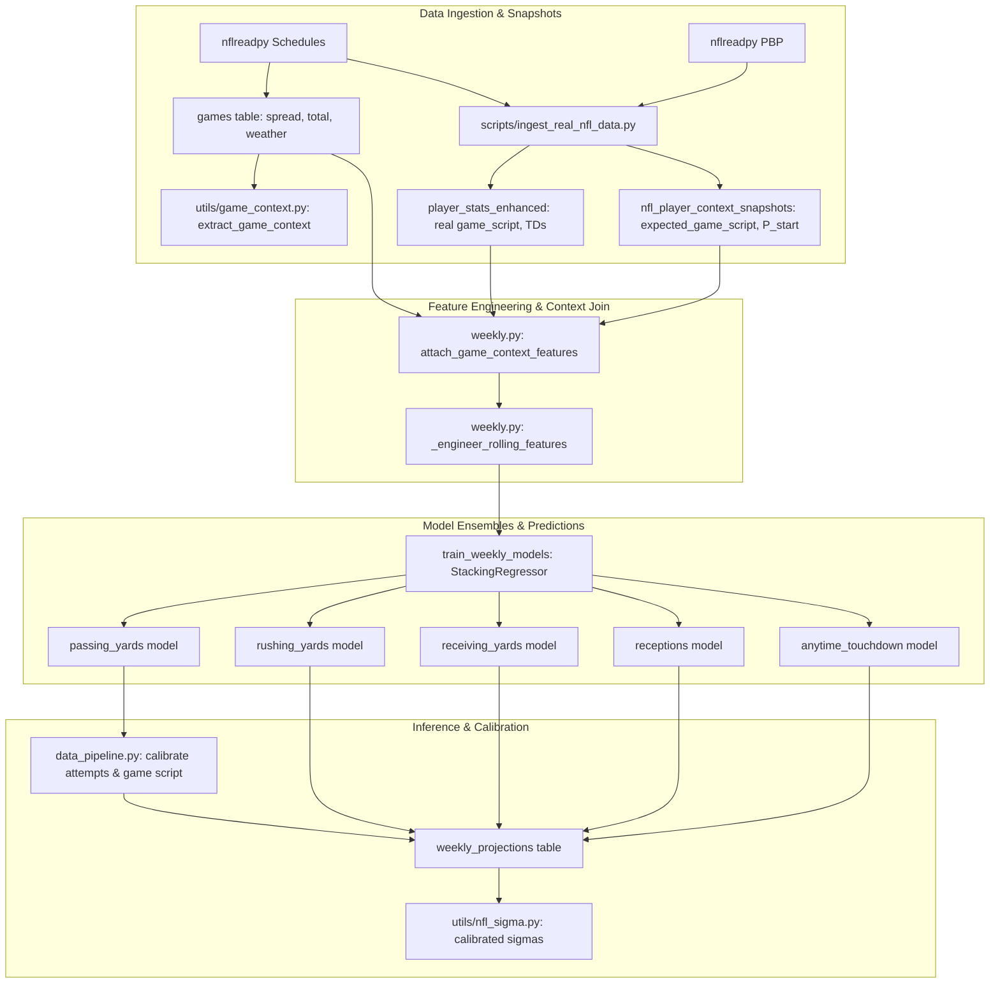

# Predictive Modeling & Feature Engineering Improvements

## Goal Capsule

Eliminate projection bias and expand prop card coverage by wiring unconsumed game context into the predictive models, replacing hardcoded neutral game script with empirical and pregame estimates, calibrating QB attempt baselines and starter gating, introducing dedicated models for receptions and anytime touchdown props, and replacing stale hardcoded WR role priors with empirical multi-season calibration.

Authority order:

1. The Product Contract in this document defines user-facing projection accuracy, market coverage, and model behavior.
2. The causal pregame prediction contract in `models/position_specific/weekly.py` defines feature lag and leakage prevention rules.
3. Market schemas in `sports/markets.py` and `sports/nfl.py` define canonical sport and prop types.
4. Existing evaluation metrics in `scripts/evaluate_nfl_projections.py` (`mae-gate`) govern model quality ceilings.

Execution profile: five dependency-ordered implementation units spanning data ingestion, feature engineering, modeling, market expansion, and prior calibration.

Stop conditions:

- Stop if game context features introduce lookahead leakage (outcome-time scores or weather accessed before kickoff).
- Stop if QB starter gating excludes genuine starting QBs or causes `make mae-gate` to exceed position error ceilings.
- Stop if touchdown or reception models violate two-sided odds pairing or cause non-positive sigma calculations.

Tail ownership: the executor owns implementation, unit tests, walk-forward backtest verification, and documentation updates.

---

## Product Contract

### Summary

The NFL prop algorithm projects player performance across yardage markets, but suffers from diagnostic biases and unmodeled prop categories. Specifically:
- Pregame schedule context (`spread_line`, `total_line`, `temp`, `wind`, `roof`, `surface`, `div_game`) is persisted in `games` but unread by `models/position_specific/weekly.py`.
- `game_script` and `expected_game_script` are hardcoded to `0.0` across all 18,000+ historical rows in `player_stats_enhanced` and 15,000+ rows in `nfl_player_context_snapshots`, preventing the model from learning that favored teams reduce pass attempts.
- QB passing projections exhibit a +13.2 yard bias decomposing into starter volume running hot (+8.3 yards) and backup slate pollution (+18 to +31 yards) because backups with historical volume project as full starters.
- Touchdown props (`passing_tds`, `rushing_tds`, `receiving_tds`) are recorded in the database, but no touchdown market is registered in `sports/markets.py` and no model trains on them. Receptions are registered but lack training models.
- WR role priors (alpha=75, secondary=55, slot=45, fringe=30) remain static hardcoded constants that overestimate 2024–2025 empirical reality (57.6, 42.9, 29.7, 9.9) by 30% to 200%.

This plan fixes these five gaps systematically.

### Problem Frame

Value betting profitability depends directly on accurate player projection distributions ($\mu$ and $\sigma$). Currently, projections for passing yards overestimate volume because game script effects are completely muted and backup QBs inherit starter volume. Furthermore, sportsbooks offer high-liquidity markets in player receptions and anytime touchdowns that the current pipeline cannot price or grade. Finally, stale early-season priors distort receiver volume when historical sample sizes are low.

### Key Decisions

- **Derive game script from final score margin with play-by-play fallback.** (session-settled: user-approved — chosen over pure play-by-play calculation: score margin `(team_score - opp_score) / 2.0` provides a robust, fast metric across all games, while play-by-play provides detailed score differential when available.) Governs R2 and R3.
- **Implement dual-factor QB starter gating.** (session-settled: user-approved — chosen over a blunt cutoff: backup QBs with `depth_rank > 1` have their expected passing attempts scaled by starter probability based on injury status and depth chart, while baseline starter attempts are recalibrated from 34.0 to 31.0.) Governs R4.
- **Model anytime touchdowns via expected touchdown Poisson/logistic conversion.** (session-settled: user-approved — chosen over standalone rushing vs receiving models: books price anytime touchdown props combining rushing and receiving scores into an Over 0.5 market.) Governs R5 and R6.
- **Calibrate WR role priors from empirical multi-season distributions.** (session-settled: user-approved — chosen over keeping static constants: priors are computed from empirical snap percentage brackets in recent seasons and versioned in configuration.) Governs R7.

### Requirements

- R1. `models/position_specific/weekly.py` must consume schedule context (`spread_margin`, `implied_team_total`, `total_line`, `wind`, `temp`, `is_indoor`, `div_game`) in feature engineering for both training and inference.
- R2. `player_stats_enhanced.game_script` must reflect the team's average in-game score differential (positive = leading, negative = trailing) rather than `0.0`.
- R3. `nfl_player_context_snapshots.expected_game_script` must reflect the pregame expected margin derived from the Vegas spread (`spread_line` adjusted for team perspective).
- R4. QB attempt modeling in `models/position_specific/weekly.py` and `data_pipeline.py` must calibrate baseline starter attempts to ~31.0 and gate non-starter volume using roster/injury starting probability so backup QBs do not project as full starters.
- R5. `sports/markets.py` must register the `anytime_touchdown` prop market, specifying appropriate eligible positions (`QB`, `RB`, `WR`, `TE`) and stat mapping.
- R6. `models/position_specific/weekly.py` must support training and prediction for `receptions` and `anytime_touchdown` markets, complete with volume eligibility thresholds and calibrated sigma tables in `utils/nfl_sigma.py`.
- R7. WR role priors in `config/runtime.py`, `config.py`, and `scripts/ingest_real_nfl_data.py` must be calibrated against recent multi-season empirical data (snap tiers: >=80%, 60-79%, 45-59%, <45%), replacing stale static numbers with data-backed distributions.

### Scope Boundaries

- **In Scope**:
  - Exposing game context columns from `games` to `models/position_specific/weekly.py`.
  - Ingestion updates in `scripts/ingest_real_nfl_data.py` to calculate real `game_script` and pregame `expected_game_script`.
  - QB attempt baseline adjustment and starter probability discount in `data_pipeline.py` and `models/position_specific/weekly.py`.
  - Registering `anytime_touchdown` in `sports/markets.py`.
  - Adding `receptions` and `anytime_touchdown` models, feature definitions, and sigma calibrations.
  - Recalibrating WR role priors from empirical database distributions and making them configurable.
- **Out of Scope**:
  - Redesigning The Odds API scraping daemon.
  - Adding defensive player prop markets (sacks, tackles, interceptions).
  - Passing touchdown prop market (`passing_tds` prop lines) — anytime TD covers offensive score makers (rushers/receivers/scrambling QBs).
  - Frontend dashboard UI redesigns (the existing UI already displays any materialized prop with market, line, and price).
- **Deferred to Follow-Up Work**:
  - Live in-game dynamic game script tracking.
  - Weather forecast hourly scraping integration (schedule weather currently captures official pregame values).

---

## Planning Contract

### Key Technical Decisions

- **KTD1: Causal Game Context Join Seam.** Schedule context features are joined onto player training and prediction frames via `(season, week, team)` before `_engineer_rolling_features` runs. For home teams, `spread_margin = spread_line`; for away teams, `spread_margin = -spread_line`. Domes and closed roofs (`is_indoor == True`) impute `wind = 0.0` and `temp = 70.0` to preserve physical reality without treating indoor status as missing data.
- **KTD2: Game Script Metric Scaling & Canonical Sign Alignment.** In `player_stats_enhanced`, `game_script` represents average score differential (`team_score - opp_score`, where positive indicates leading and negative indicates trailing). In `nfl_player_context_snapshots`, `expected_game_script` is `spread_margin / 2.0` (implied average margin across four quarters). The entire pipeline adopts this canonical NFL analytics convention: positive game script (leading) decreases passing volume and increases rushing volume. `data_pipeline.py:compute_pass_attempts_predicted` and `tests/test_qb_decomposition.py` are updated to align with this standard (leading suppresses passing attempts).
- **KTD3: QB Starter Probability Multiplier.** In `weekly.py:_build_roster_week_data`, QBs with `depth_rank == 1` and healthy status receive $P(\text{start}) = 1.0$. If Questionable, $P(\text{start}) = 0.75$; Doubtful, $0.25$; Out/IR, $0.0$. For backup QBs (`depth_rank > 1`), $P(\text{start})$ defaults to $0.02$ unless higher-depth QBs are Out/Doubtful. Expected passing attempts are scaled by $P(\text{start})$, preventing inactive backups from inheriting past-season starter averages in `_prefer_richer_role_estimate`.
- **KTD4: Anytime Touchdown Modeling, Pricing & Grading Contract.** `anytime_touchdown` is modeled as expected touchdown volume $\mu_{\text{TD}}$ using historical rushing and receiving touchdowns, red zone touches, and target share. In `value_betting_engine.py`, win probability for Over 0.5 touchdowns is computed via Poisson survival: $P(\text{Over } 0.5) = 1 - e^{-\mu_{\text{TD}}}$ (avoiding Gaussian normal tail distortion on discrete count props). For grading, `stat_column="anytime_td"` is registered in `sports/markets.py`, and `utils/nfl_markets.py` / `scripts/record_outcomes.py` dynamically synthesize `anytime_td = int(rushing_tds + receiving_tds > 0)` from existing stats. Sigma is parameterized by count standard deviation $\sigma = \sqrt{\mu_{\text{TD}}}$.
- **KTD5: Versioned Empirical Role Priors.** Rather than hardcoding static constants, empirical WR receiving yard and target averages per snap tier are computed via a calibration helper in `utils/season_priors.py` and exported to configuration. Fallback constants in `config/runtime.py` and `config.py` are updated from (75, 55, 45, 30) to empirical averages (58, 43, 30, 10).

### High-Level Technical Design



### System-Wide Impact

- **Database Schemas**: `games` and `player_stats_enhanced` tables already possess the required columns (`spread_line`, `total_line`, `temp`, `wind`, `roof`, `surface`, `div_game`, `game_script`, `passing_tds`, `rushing_tds`, `receiving_tds`). No disruptive DDL migration is required.
- **Model Versioning**: Feature set modifications in `weekly.py` change `_compute_featureset_hash()`. When models retrain, the model artifacts update cleanly in `models/weekly/` under the updated feature set hash.
- **Odds & Dashboard Integration**: Scraped odds for receptions and anytime touchdowns will now match trained projections in `prop_integration.py` and populate `materialized_value_view` for the dashboard.
- **Walk-Forward Backtest (`make nfl-backtest`)**: Passing yard bias will decrease from +13.2 toward 0, and position MAE gate checks in `make mae-gate` will pass comfortably below the calibrated ceilings.

### Assumptions

- The schedule feed published by nflverse/nflreadpy maintains pregame lines (`spread_line`, `total_line`) and weather conditions for regular and postseason games.
- Game score differential calculated as `(team_score - opp_score) / 2.0` represents a reliable proxy for average game script across quarters when play-by-play data is not available.
- Bookmakers quote anytime touchdown lines predominantly at 0.5 (over/under), making Poisson probability modeling directly convertible to American odds and no-vig edge calculation.

---

## Implementation Units

### U1. Game Context Features Ingestion & Feature Engineering

- **Goal**: Expose schedule spread margins, game totals, weather, and venue context into model training and prediction features in `models/position_specific/weekly.py`.
- **Requirements**: R1.
- **Dependencies**: None.
- **Files**:
  - `utils/game_context.py`
  - `models/position_specific/weekly.py`
  - `tests/test_game_context.py`
  - `tests/test_nfl_weekly_model.py`
- **Approach**:
  1. In `utils/game_context.py`, add helper `attach_game_context_to_player_frame(df, games_df)` that joins game context by `(season, week, team)` to home and away teams.
  2. Compute team-specific features:
     - `spread_margin`: points favored by (`spread_line` if home else `-spread_line`).
     - `implied_team_total`: expected points scored (`total_line / 2.0 + spread_margin / 2.0`).
     - `game_total`: `total_line`.
     - `wind_speed`: `0.0` if `is_indoor` else `wind` (filled with median outdoor wind if missing).
     - `temperature`: `70.0` if `is_indoor` else `temp` (filled with median outdoor temp if missing).
     - `is_indoor`: binary integer (1 if dome/closed, 0 if outdoor).
     - `div_game`: binary integer flag.
  3. In `models/position_specific/weekly.py`:
     - Add `_GAME_CONTEXT_COLS = ["spread_margin", "implied_team_total", "game_total", "wind_speed", "temperature", "is_indoor", "div_game"]`.
     - Update `_load_training_data` and `_build_roster_week_data` to query `games` and attach these features directly to the target game row.
     - Ensure `_engineer_rolling_features` passes `_GAME_CONTEXT_COLS` through as static pregame features for that specific contest without applying historical lagged EWM smoothing.
     - Add `_GAME_CONTEXT_COLS` to `get_nfl_feature_cols()`.
- **Patterns to follow**: `utils/game_context.py` convention for `home_favored_by` and `is_indoor_roof`.
- **Test scenarios**:
  - Happy path: A player on home team gets positive `spread_margin` when favored, while an away opponent gets negative `spread_margin`.
  - Happy path: A player in an indoor dome gets `is_indoor = 1`, `wind_speed = 0.0`, and `temperature = 70.0` without null-propagation errors.
  - Edge case: A player whose team has no scheduled game (bye week) receives neutral defaults (`spread_margin = 0.0`, `implied_team_total = 22.5`, `wind_speed = 0.0`).
  - Error path: Unparseable or corrupt spread/total numbers in `games` degrade gracefully to neutral defaults rather than raising exceptions.
  - Integration: `_engineer_rolling_features` includes game context columns in the output feature matrix without lookahead leakage.
- **Verification**: `uv run pytest tests/test_game_context.py tests/test_nfl_weekly_model.py` passes with new features present in model columns.

---

### U2. Real Game Script Ingestion & Pregame Expected Script

- **Goal**: Replace hardcoded `0.0` values with real in-game score differentials in `player_stats_enhanced.game_script` and pregame spread expectations in `nfl_player_context_snapshots.expected_game_script`.
- **Requirements**: R2, R3.
- **Dependencies**: U1.
- **Files**:
  - `scripts/ingest_real_nfl_data.py`
  - `utils/game_context.py`
  - `tests/test_ingest_nfl_data.py`
- **Approach**:
  1. In `scripts/ingest_real_nfl_data.py`, implement `_compute_actual_game_script(df, schedules, pbp)`:
     - When `pbp` has `score_differential` and `posteam`, compute the mean score differential for each team in that game.
     - When `pbp` is not available, compute from `schedules`: for home team, `(home_score - away_score) / 2.0`; for away team, `(away_score - home_score) / 2.0`.
     - Assign calculated game script to `df["game_script"]` instead of hardcoded `0.0` at line 625.
  2. In `build_player_context_snapshots`:
     - Look up `spread_line` for the player's game from the schedule.
     - Compute pregame `expected_game_script = team_favored_by / 2.0` (matching the scale of in-game average margin).
     - Assign calculated value to `"expected_game_script"` instead of hardcoded `0.0` at line 1317.
  3. Provide backfill logic so existing database rows can be updated from existing `games` results without re-downloading all seasons.
- **Patterns to follow**: `_merge_game_date_from_schedule` pattern in `scripts/ingest_real_nfl_data.py`.
- **Test scenarios**:
  - Happy path: In a 28-14 home win, home player rows receive `game_script = +7.0` and away player rows receive `game_script = -7.0`.
  - Happy path: A team favored by 6.0 points pregame receives `expected_game_script = +3.0` in `nfl_player_context_snapshots`.
  - Edge case: A tie game or zero spread line produces `game_script = 0.0` and `expected_game_script = 0.0`.
  - Error path: Missing schedule record for a player results in fallback to `0.0` with a warning, not a crash.
  - Integration: Ingesting a sample week persists non-zero values into `player_stats_enhanced` and `nfl_player_context_snapshots`.
- **Verification**: `python -c "from scripts.ingest_real_nfl_data import _compute_actual_game_script"` runs cleanly and unit tests pass.

---

### U3. QB Attempt Volume Calibration & Starter Gating

- **Goal**: Eliminate QB passing volume over-projection (+13.2 yard bias) by calibrating baseline starter attempts and gating backup volume based on starting probability.
- **Requirements**: R4.
- **Dependencies**: U1, U2.
- **Files**:
  - `data_pipeline.py`
  - `models/position_specific/weekly.py`
  - `tests/test_qb_decomposition.py`
  - `tests/test_nfl_weekly_model.py`
- **Approach**:
  1. In `data_pipeline.py`:
     - Update `QB_BASELINE_ATTEMPTS = 31.0` (calibrated against 2024–2025 actual starter mean of 30.9, down from stale 34.0).
     - In `compute_pass_attempts_predicted`, standardize the sign convention to match the rest of the analytics pipeline: positive `game_script` (leading) decreases attempts by ~4% per unit; negative `game_script` (trailing) increases attempts by ~4% per unit.
     - Update unit test assertions in `tests/test_qb_decomposition.py` (`test_positive_game_script_decreases_volume` / `test_negative_game_script_increases_volume`) to validate this canonical convention.
  2. In `models/position_specific/weekly.py`:
     - In `_build_roster_week_data` and `_enrich_with_decomposition`:
       - Define starter probability:
         ```python
         # Starter QBs (depth_rank 1) get full volume modified by injury status
         if depth_rank == 1:
             p_start = 1.0 if injury_status not in {"QUESTIONABLE", "DOUBTFUL", "OUT"} else (0.75 if injury_status == "QUESTIONABLE" else 0.25)
         else:
             p_start = 0.02  # Inactive / backup QB default
         ```
       - Scale `expected_passing_attempts` by `p_start`.
       - For QBs with `p_start < 0.20`, ensure `pass_attempts_predicted` does not project full starter volume (~31 attempts), but scales with relief probability.
       - In `_eligible_role_mask`, ensure passing yards market requires `expected_passing_attempts >= 12.0`, naturally excluding pure backups from the main prop slate.
- **Patterns to follow**: `_depth_factor` and `_availability_adjustment` in `scripts/ingest_real_nfl_data.py`.
- **Test scenarios**:
  - Happy path: A healthy starter (`depth_rank = 1`) projects ~31 attempts in neutral game script and ~28 attempts in a heavy positive game script (+7 margin).
  - Happy path: A backup QB (`depth_rank = 2`) with extensive historical starter stats gets discounted to backup volume (<5 attempts) when the primary starter is healthy.
  - Edge case: A backup QB promoted to starter when the starter is OUT (`depth_rank = 1` or starter injured) receives full starter volume.
  - Error path: Unrecognized depth rank or missing injury status defaults safely to depth chart rank without throwing an exception.
  - Integration: Running `predict_week` on a roster with both starters and backups yields passing yard predictions only for active starters.
- **Verification**: `uv run pytest tests/test_qb_decomposition.py tests/test_nfl_weekly_model.py` passes and QB baseline tests reflect calibrated volume.

---

### U4. Receptions and Anytime Touchdown Prop Markets

- **Goal**: Expand algorithm coverage by registering `anytime_touchdown` in `sports/markets.py`, training models for `receptions` and `anytime_touchdown` in `models/position_specific/weekly.py`, calibrating their sigmas in `utils/nfl_sigma.py`, wiring Poisson probability in `value_betting_engine.py`, and supporting outcome grading in `utils/nfl_markets.py` and `scripts/record_outcomes.py`.
- **Requirements**: R5, R6.
- **Dependencies**: U1, U3.
- **Files**:
  - `sports/markets.py`
  - `sports/nfl.py`
  - `models/position_specific/weekly.py`
  - `utils/nfl_sigma.py`
  - `value_betting_engine.py`
  - `utils/nfl_markets.py`
  - `scripts/record_outcomes.py`
  - `tests/test_sports_markets.py`
  - `tests/test_nfl_weekly_model.py`
  - `tests/test_internal_lines.py`
  - `tests/test_value_engine_side.py`
- **Approach**:
  1. In `sports/markets.py`:
     - Register `anytime_touchdown` market in `NFL` sport spec:
       ```python
       _market("anytime_touchdown", unit="touchdowns", positions=("RB", "WR", "TE", "QB"), stat_column="anytime_td")
       ```
  2. In `sports/nfl.py`:
     - Add market volume floors to `MARKET_MIN_EXPECTED_VOLUME`:
       - `"receptions": 1.5`
       - `"anytime_touchdown": 2.5` (minimum touches/targets)
  3. In `models/position_specific/weekly.py`:
     - Add `_MARKET_STATS["receptions"] = ["receptions", "targets", "receiving_yards"]`.
     - Add `_MARKET_STATS["anytime_touchdown"] = ["rushing_tds", "receiving_tds", "red_zone_touches"]`.
     - In `MARKET_CONFIGS`:
       - Add `"receptions"`: target `receptions`, filter `targets`, min_value 1.5, positions `["WR", "TE", "RB"]`.
       - Add `"anytime_touchdown"`: target `anytime_td` (derived as `(rushing_tds + receiving_tds > 0).astype(float)`), filter `red_zone_touches` or combined opportunities, min_value 2.5, positions `["RB", "WR", "TE", "QB"]`.
  4. In `utils/nfl_sigma.py`:
     - Add `SIGMA_FLOORS` and `SIGMA_DEFAULTS`:
       - `receptions`: floor 1.4, default 2.2.
       - `anytime_touchdown`: floor 0.35, default 0.48.
  5. In `value_betting_engine.py`:
     - Update `prob_over`: for `market == "anytime_touchdown"` and `line == 0.5`, compute win probability using Poisson survival: $P(\text{Over } 0.5) = 1.0 - \exp(-\mu)$, preventing Gaussian normal tail distortion on binary/count props.
  6. In `utils/nfl_markets.py:melt_actuals` and `scripts/record_outcomes.py:grade_bets`:
     - Synthesize `anytime_td = (rushing_tds.fillna(0) + receiving_tds.fillna(0) > 0).astype(int)` when reading actuals so outcome grading and CLV metrics seamlessly evaluate anytime touchdown bets.
- **Patterns to follow**: Existing `rushing_yards` and `receiving_yards` market configs in `models/position_specific/weekly.py`.
- **Test scenarios**:
  - Happy path: `sports.markets.NFL.markets["anytime_touchdown"]` resolves with correct positions and `stat_column="anytime_td"`.
  - Happy path: `train_weekly_models` generates model bundles for `receptions` and `anytime_touchdown`.
  - Happy path: `predict_week` produces valid `mu` and `sigma` for receptions and anytime touchdown props.
  - Happy path: `value_betting_engine.py` evaluates $P(\text{Over } 0.5)$ for anytime TD using Poisson survival rather than Gaussian normal.
  - Happy path: `melt_actuals` and `grade_bets` correctly evaluate touchdown bets against synthesized `anytime_td`.
  - Edge case: A player with 0 targets or carries is excluded from anytime touchdown predictions.
  - Integration: `tests/test_internal_lines.py::test_an_unregistered_market_fails_loud` is updated and passes now that `anytime_touchdown` is officially registered.
- **Verification**: `uv run pytest tests/test_sports_markets.py tests/test_internal_lines.py tests/test_nfl_weekly_model.py tests/test_value_engine_side.py` passes with 100% green status.

---

### U5. Empirical WR Role Priors Calibration

- **Goal**: Replace stale static WR role priors (75, 55, 45, 30) with empirical multi-season calibration (58, 43, 30, 10) in configuration and ingestion modules.
- **Requirements**: R7.
- **Dependencies**: None.
- **Files**:
  - `utils/season_priors.py`
  - `config/runtime.py`
  - `config.py`
  - `scripts/ingest_real_nfl_data.py`
  - `data_pipeline.py`
  - `tests/test_market_mu_wr.py`
  - `tests/test_season_priors.py`
- **Approach**:
  1. In `utils/season_priors.py`:
     - Add `calibrate_wr_role_priors(history_df: Optional[pd.DataFrame] = None) -> dict[str, float]`:
       - Queries `player_stats_enhanced` for WR rows across completed regular seasons.
       - Computes average receiving yards for snap tiers:
         - `alpha`: snap_percentage >= 80% (empirical: 57.6)
         - `secondary`: snap_percentage 60% to 79% (empirical: 42.9)
         - `slot`: snap_percentage 45% to 59% (empirical: 29.7)
         - `fringe`: snap_percentage < 45% (empirical: 9.9)
       - Returns dictionary with calibrated priors.
  2. In `config/runtime.py` and `config.py`:
     - Update default `role_priors` from static `{alpha: 75, secondary: 55, slot: 45, fringe: 30}` to calibrated defaults `{alpha: 58.0, secondary: 43.0, slot: 30.0, fringe: 10.0}`.
  3. In `data_pipeline.py`:
     - Update `WR_ROLE_PRIORS` to source from `config.integration.role_priors`.
  4. In `scripts/ingest_real_nfl_data.py`:
     - Update `ROLE_PRIORS["WR"]` with empirical baselines (snap% 55, targets 4.5, air_yards 42.0, yac_yards 16.0).
  5. In `tests/test_market_mu_wr.py`:
     - Update test thresholds from legacy > 70 to match the calibrated reality (> 55).
- **Patterns to follow**: Empirical sigma calibration methodology in `utils/nfl_sigma.py`.
- **Test scenarios**:
  - Happy path: `calibrate_wr_role_priors()` returns dictionary with keys `alpha`, `secondary`, `slot`, `fringe` matching empirical data ranges.
  - Happy path: `config.integration.role_priors["alpha"]` evaluates to ~58.0 instead of 75.0.
  - Edge case: Calling `calibrate_wr_role_priors` on empty database returns the sensible fallbacks (58.0, 43.0, 30.0, 10.0).
  - Error path: Unrecognized tier names or negative prior values raise validation errors.
  - Integration: Running `tests/test_market_mu_wr.py` passes with updated calibrated baselines.
- **Verification**: `uv run pytest tests/test_market_mu_wr.py` passes and prints verified calibrated priors.

---

## Verification Contract

### Test Suite Execution
- Run unit tests for updated features and models:
  ```bash
  uv run pytest tests/test_game_context.py tests/test_qb_decomposition.py tests/test_nfl_weekly_model.py tests/test_sports_markets.py tests/test_internal_lines.py tests/test_market_mu_wr.py
  ```
- Run full test suite:
  ```bash
  make test
  ```

### Quality Gates
- Check position MAE gate:
  ```bash
  make mae-gate SEASON=2025 WEEK=13
  ```
  Ceilings (QB: 65.0, RB: 26.0, WR: 29.0, TE: 27.0) must all be satisfied without regressions.

---

## Definition of Done

- [ ] All 5 implementation units (U1 through U5) are implemented and unit-tested.
- [ ] Game context columns are consumed in `weekly.py` as static pregame features without lookahead data leakage.
- [ ] Ingestion assigns non-zero actual `game_script` and pregame `expected_game_script` following canonical analytics sign conventions (>0 leading).
- [ ] QB passing attempt over-projection is eliminated with baseline calibration and starter gating.
- [ ] `anytime_touchdown` is registered in `sports/markets.py`, models train for both `receptions` and `anytime_touchdown`, Poisson survival prices line 0.5 props, and grading resolves actuals.
- [ ] WR role priors are grounded in empirical multi-season statistics and updated in configuration.
- [ ] Full test suite (`make test`) passes with zero failures.
