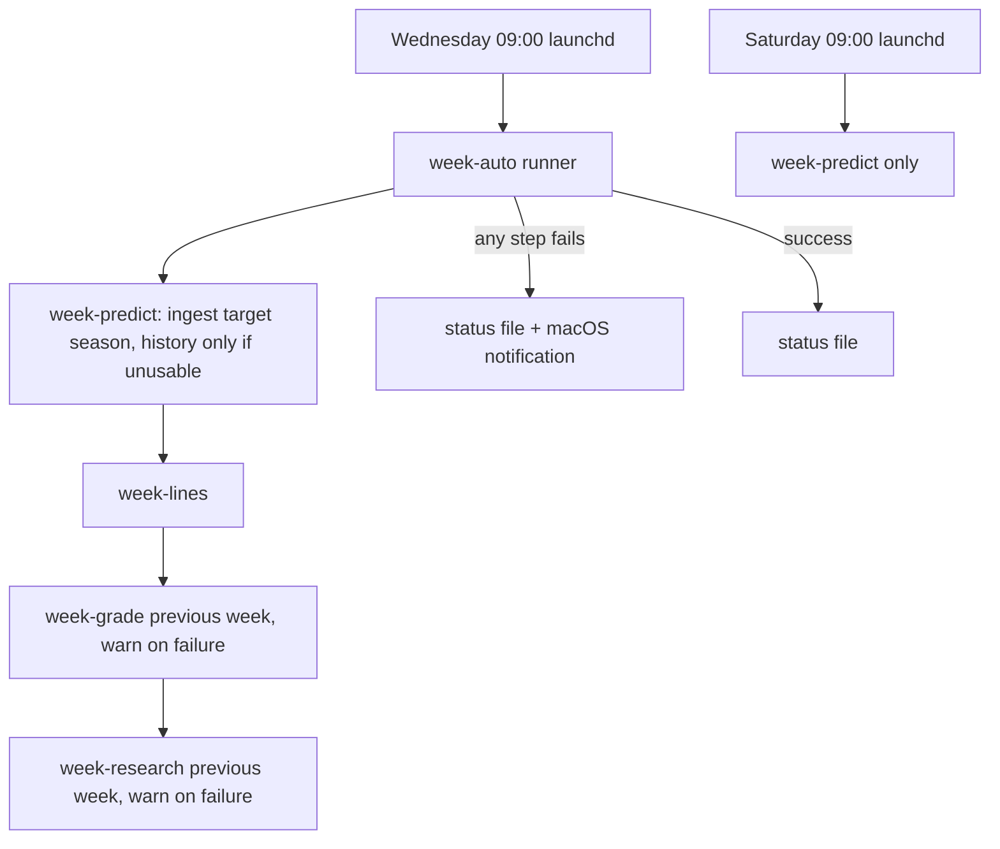
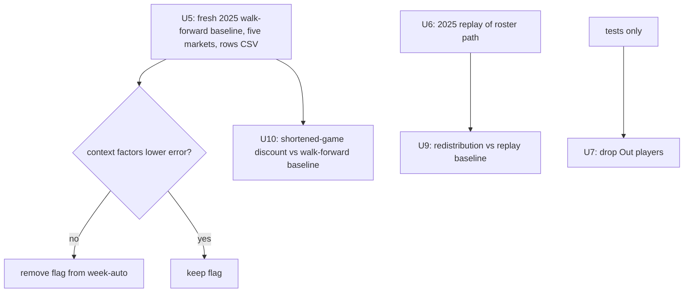

# NFL Weekly Reliability and Projection Accuracy - Plan

## Goal Capsule

- **Objective:** make the Wednesday weekly run finish every week and say so when it does not, then improve projection accuracy with changes that each prove themselves on a 2025 walk-forward or replay backtest, then close the open audit items.
- **Authority, highest first:** the user's messages in the session, this plan, repo `CLAUDE.md`, `~/.claude/rules/*`.
- **Execution profile:** many small single-topic commits (conventional subjects, no AI attribution). Bug fixes start with a failing test. Back up `nfl_data.db` before any run that writes it.
- **Stop and ask before:** spending Odds API credits, pushing or merging, deleting rows outside a unit's stated scope, rotating keys, or any change to `main`.
- **Stop and report when:** a model change fails its backtest gate (drop the change, do not tune until it passes), the 2025 injury or depth feed cannot rebuild weekly snapshots (U6), or a unit needs a product decision this plan does not make.
- **Tail ownership:** the executor commits locally on `fix/grade-once-per-bet`. Pushing and merging stay with the user.

---

## Product Contract

### Summary

Harden the weekly job so a dropped download or a crash no longer silently skips a week, and recover the weeks already missed. Add a 2025 replay backtest that runs the real roster-backed prediction path. Use it, plus a fresh walk-forward baseline, to judge four model changes: dropping players ruled Out, giving their volume to teammates, discounting injury-shortened games, and the context factors. Fix the stake cap, the stage order around the card, and the learning loop's id join.

### Problem Frame

The Wednesday launchd job (`make week-auto`) has not finished a week since week 1. Week 1's earlier attempt died on a DNS error, weeks 2 and 3 crashed in `week-predict` on `Unsupported market 'receptions'`, and week 4 died on 2026-09-30 when a connection reset hit `injuries_2024.parquet`, a history season the job re-downloads every Wednesday. Nothing alerted, so week 4 had no projections and week 3 was never researched.

On accuracy, players ruled Out still get full projections (2026 week 3: 59 Out players, 34 projection rows, `HOU_nico_collins` at 49.3 receiving yards). Ingest already zeroes their volume, but `weekly.py` restores it by taking the max of snapshot and history. Teammates of an Out player get no extra volume, and injury-shortened games drag role averages down for weeks (Darnold: 5 snaps in 2026 week 1 cut his expected attempts from 33.7 to 17.6).

The measurement tools cannot judge these changes yet. The only 2025 baseline (`reports/nfl_backtest_2025_baseline.json`, 2026-08-28) predates the September model merge and covers three markets. The walk-forward backtest uses the history path (`roster_backed=False`), which predicts only players who recorded stats, so it never sees injuries, depth charts, or Out players. Week 1 real-money results (+0.17% ROI, -11.5bp CLV, worse ROI as edge rises) mean backtest wins are necessary but not sufficient.

### Requirements

**Weekly run reliability**

- R1. A transient network failure while downloading an nflverse feed is retried with backoff before the ingest fails. Missing-feed handling for history and current seasons stays as it is today.
- R2. The Wednesday run does not re-download finished history seasons when the stored history is already usable.
- R3. A failed Wednesday run produces a visible alert on this machine and a persisted status record naming the week, the failed step, and the exit code.
- R4. The final injury report reaches projections before Sunday without a manual run.

**Catch-up**

- R5. 2026 week 4 has projections and internal lines for every team whose game had not kicked off at recovery time, and week 3 has its research memo. Pregame rows for teams that already played stay untouched.

**Measurement**

- R6. A fresh 2025 walk-forward baseline of the current model covers all five markets and stores its per-row output. Every model change below is compared against it or against R7's replay baseline.
- R7. A 2025 replay backtest runs the production roster-backed path week by week with that week's injury report and depth chart as of kickoff, without writing to the production database or model bundles.
- R8. The context factors stay switched on in the Wednesday run only if the backtest shows they lower error.

**Model accuracy**

- R9. A player ruled Out or placed on injured reserve on the target week's own injury report gets no projection. A status carried forward from last week's report does not drop a player.
- R10. When a player is ruled Out, his team's same-position teammates receive part of his expected volume, and a backup QB is promoted when the starter is Out. Ships only if R7's replay shows lower error.
- R11. Games a player left early count less in his role and rolling averages. Ships only if R6's walk-forward shows lower error.

**Audit leftovers**

- R12. The portfolio stake cap limits the sum of best-line stakes, one per bet, rather than the sum over every sportsbook's row.
- R13. The risk and agent stages judge the card being built in the current run, and stale verdicts from earlier runs of the same week do not survive.
- R15. The learning loop matches projections to actuals through the gsis id bridge, and its failures are logged instead of swallowed.

### Scope Boundaries

- Odds scraping stays manual. Nothing in this plan schedules or runs `make production-run`.
- No NBA work, no frontend work, no key rotation, no push or merge.
- Agent verdicts stay one per prop. The coordinator merges both sides on purpose (`_group_reports` and `_one_vote_per_agent` in `agents/coordinator.py`), so the missing `side` column loses nothing.
- Doubtful players keep their projections. Props void when a player sits, so an "if he plays" projection stays valid for them.

#### Deferred to Follow-Up Work

- Sigma recalibration after the mu changes land (needs a 2026 walk-forward to avoid fitting in-sample again).
- The train and serve gap on `expected_game_script`: production takes `fmax` of the spread-based snapshot and the lagged realized margin, training sees only the latter.
- Wiring the tracked market blend into the private `rank_weekly_value`.
- FTN charting and pbp EPA features.
- Moving the QB decomposition math out of `weekly.py` into a tracked module.

---

## Planning Contract

### Key Technical Decisions

- KTD1. **Every model change is gated on a backtest and is dropped if it does not lower error.** (session-settled: user-approved — chosen over shipping on judgment: no guessing about model quality.) R9 is the exception and ships on tests, because a player ruled Out cannot play; the user saw this exception when choosing KTD2.
- KTD2. **Judge Out-driven changes on a 2025 replay of the production path.** (session-settled: user-directed — chosen over a hindsight proxy that treats "had a role, no stat line" as Out: the proxy knows after the fact who sat and overstates gains.) The replay rebuilds each week's snapshot with the pure `build_player_context_snapshots` and cutoffs at that week's first kickoff.
- KTD3. **Private `weekly.py` changes stay local; their math lives in tracked modules.** (session-settled: user-approved — chosen over limiting the plan to tracked code, which would cut most of the accuracy work.) Each `weekly.py` edit gets a `docs/DEPLOYMENT_MANIFEST.md` entry and a commit message that names it as local-only, following `a634b19` and `8222922`. Grep private files with `command grep`.
- KTD4. **Odds pulls stay manual.** (session-settled: user-approved — chosen over scheduling `production-run`: every pull spends paid credits.)
- KTD5. **Reliability and catch-up land before any model work.** (session-settled: user-approved — chosen over starting with accuracy: a model change is worthless in a week the job does not run.)
- KTD6. **Retry inside `_load_nflverse_by_season`, for transient network errors only.** nflreadpy 0.1.5 makes one `session.get` with no retry and re-raises the builtin `ConnectionError` (`.venv/lib/python3.13/site-packages/nflreadpy/downloader.py:96-97`), so the retry must catch the builtin and `requests` connection and timeout errors and HTTP 5xx, and must not catch what `_is_missing_feed_error` classifies as a missing feed. After the last attempt the original error is raised. The NBA helper `_fetch_with_retry` (`scripts/ingest_nba_data.py:53-91`) is not reused: it returns an empty frame on exhaustion, which breaks the fail-loud rule for history.
- KTD7. **Drop the standalone `ingest-nfl` step from `week-auto`.** `week-predict` already ingests the target season and re-ingests history only when `_history_is_usable` fails (`scripts/prepare_nfl_week.py:216-227`). This removes the weekly history download and the stray 2026 week 18 snapshot that `THROUGH_WEEK ?= 18` writes. No nflreadpy disk cache: with one downloading process left it saves little, and its one-day default would serve a stale injury report to a same-day rerun.
- KTD8. **Alert through a macOS notification plus a status file.** A small tracked runner wraps the `week-auto` steps, writes `logs/week_auto_status.json` on every run (week, step, exit code, timestamps), and on failure calls `osascript` to post a notification. Email or Slack needs credentials and is out of scope. The log gains a timestamped header per run.
- KTD9. **A second scheduled run on Saturday refreshes context and projections.** It runs `week-predict` only, which is late-run safe: kicked-off teams keep their pregame rows (`scripts/prepare_nfl_week.py:262-267`). The plist lives in the repo as a template, installed by a make target.
- KTD10. **Record the injury report's week on each context snapshot.** A new nullable `injury_report_week` column, added through `_ensure_columns` and the DDL, lets R9 drop only players whose Out status comes from the target week's report. The injury row already carries `week` (`scripts/ingest_real_nfl_data.py:1366`).
- KTD11. **Drop Out players by removing rows after the snapshot merge in `_build_roster_week_data`.** Ingest already zeroes their volume, but `_prefer_richer_role_estimate` restores it twice and the early-season prior overwrites it. Dropping rows is the one step nothing later undoes, and it keeps `test_snapshot_depth_penalty_does_not_hide_wr2_history` passing. The predicate lives in `utils/slate_eligibility.py` as a new ruled-out check for OUT and IR. The existing `OUT_INJURY_STATUSES` set that includes Doubtful keeps serving the API board.
- KTD12. **Redistribute volume before the model, behind a flag that defaults off.** A tracked module frees the Out player's expected targets, carries, or attempts and gives a damped share to same-team, same-position teammates by their current share, after the `fmax` step so it is not undone. It mirrors the damping and cap pattern in `utils/nba_injury_adjustments.py`. The flag follows `env_flag` in `config/runtime.py` plus `FEATURE_FLAGS` in `scripts/run_nfl_backtest.py`, and it turns on only after the replay passes.
- KTD13. **Flag a game as shortened when snap share is under half the player's prior six-game median and that median is at least 60%.** Snap share of 0 means a failed merge, not an absence (`scripts/ingest_real_nfl_data.py:419-420`), so it is treated as unknown. Flagged games get zero weight in role and rolling averages. About 5-6% of 2024-25 rows qualify. The flag uses lagged data only, so no target-week outcome leaks in. Behind a default-off flag until the walk-forward passes.
- KTD14. **Risk and agents read the staged card.** Move `risk_assessment` and `agents` after `materialize` in `POST_PREPARE_STAGES` and point them at the current job's `pipeline_card_staging` rows, so verdicts exist before publish and can inform it. Clear the week's `agent_decisions` before writing new ones. Write NFL `risk_assessments` with a dialect-aware upsert following `agents/coordinator.py:150-175`.

### High-Level Technical Design

The weekly run after U2, U3, and U8:

How the model changes are judged:

### Assumptions

- The nflverse injury and depth chart feeds for 2025 cover every regular-season week with dates, so U6 can rebuild weekly snapshots. U6 verifies this first and stops the replay work if it fails.
- `osascript` notifications post from a launchd job in the user's GUI session.

---

## Implementation Units

| U-ID | Title | Key files | Depends on |
|---|---|---|---|
| U1 | Retry transient nflverse download failures | `scripts/ingest_real_nfl_data.py` | none |
| U2 | Stop the weekly history re-download | `Makefile` | U1 |
| U3 | Failure alert and run status | `scripts/week_auto.py`, `Makefile` | U2 |
| U4 | Recover week 4 and research week 3 | none (operational) | none |
| U8 | Saturday projection refresh | `ops/launchd/`, `Makefile` | U3 |
| U5 | Fresh walk-forward baseline and context-factor verdict | `Makefile`, `reports/`, `CLAUDE.md` | U4 |
| U6 | 2025 replay backtest of the roster path | `utils/nfl_replay.py`, `scripts/run_nfl_backtest.py` | U5 |
| U7 | Drop players ruled Out on this week's report | `utils/slate_eligibility.py`, `schema_migrations.py`, `scripts/ingest_real_nfl_data.py`, `models/position_specific/weekly.py` | U5 |
| U9 | Give an Out player's volume to teammates | `utils/nfl_availability.py`, `models/position_specific/weekly.py` | U6, U7 |
| U10 | Discount injury-shortened games | `utils/nfl_availability.py`, `models/position_specific/weekly.py`, `scripts/ingest_real_nfl_data.py` | U5 |
| U11 | Stake cap on best-line stakes | `materialized_value_view.py` | none |
| U12 | Risk and agents judge the staged card | `scripts/production_runner.py`, `risk_manager.py`, `agents/base_agent.py`, `agents/coordinator.py` | none |
| U14 | Learning loop id bridge | `learning_loop.py` | none |
| U15 | Documentation truth pass | `CLAUDE.md`, `docs/OPERATIONS.md`, `docs/DEPLOYMENT_MANIFEST.md`, `docs/ARCHITECTURE.md`, `docs/MODEL_CARD.md` | all |

### U1. Retry transient nflverse download failures

- **Goal:** a connection reset, DNS failure, timeout, or 5xx on an nflverse download is retried with backoff before the ingest fails.
- **Requirements:** R1. Governed by KTD6.
- **Dependencies:** none.
- **Files:** `scripts/ingest_real_nfl_data.py`, `tests/test_nfl_ingest_entrypoint.py`.
- **Approach:**
  1. Add a transient-error predicate next to `_is_missing_feed_error` that walks `__cause__` the same way.
  2. Wrap the per-season loader call in `_load_nflverse_by_season` with a bounded retry, three attempts with exponential backoff. Make the sleep injectable for tests.
  3. Log each retry with the feed name and season, without URLs that could carry tokens.
- **Execution note:** start with a failing test that reproduces the 2026-09-30 builtin `ConnectionError`.
- **Patterns to follow:** `_is_missing_feed_error` cause walking; existing loader tests in `tests/test_nfl_ingest_entrypoint.py:53-130`.
- **Test scenarios:**
  - A loader that raises builtin `ConnectionError` once and then returns a frame yields that frame.
  - A loader that raises a timeout on every attempt raises the original error after three attempts.
  - A history-season 404 is not retried and still raises.
  - An optional current-season missing feed is not retried and still returns the empty-feed result.
  - A `ValueError` unrelated to the network is not retried.
- **Verification:** the new tests pass and the existing missing-feed tests still pass.

### U2. Stop the weekly history re-download

- **Goal:** `week-auto` stops downloading finished history seasons and stops writing a future week 18 snapshot.
- **Requirements:** R2. Governed by KTD7.
- **Dependencies:** U1.
- **Files:** `Makefile`, `docs/OPERATIONS.md`.
- **Approach:**
  1. Remove `$(MAKE) ingest-nfl` from `week-auto`. Keep `db-analyze`.
  2. Leave `make ingest-nfl` itself unchanged for manual history refreshes.
- **Test expectation:** none, because this is Makefile wiring. Verify with `make -n week-auto` and one real run in U3.
- **Verification:** `make -n week-auto` shows no `ingest-nfl` step, and a run downloads only 2026 feeds.

### U3. Failure alert and run status

- **Goal:** every Wednesday run leaves a status record, and a failed run posts a notification.
- **Requirements:** R3. Governed by KTD8.
- **Dependencies:** U2.
- **Files:** `scripts/week_auto.py` (new), `Makefile`, `tests/test_week_auto.py` (new), `docs/OPERATIONS.md`.
- **Approach:**
  1. Move the `week-auto` shell sequence into a tracked Python runner that runs each step as a subprocess, so status and alerting are testable.
  2. Grade and research failures stay warnings, as today. Any other step failure stops the run.
  3. Write `logs/week_auto_status.json` atomically on success and failure, and print a timestamped header to the log.
  4. On failure, post a macOS notification through `osascript`. Notification failure is logged, never fatal.
  5. `make week-auto` calls the runner, so the launchd plist does not change.
- **Patterns to follow:** step order and warning semantics in the current `week-auto` target (`Makefile:385-401`).
- **Test scenarios:**
  - When every step succeeds, the status file records success, the week, and no failed step, and no notification is posted.
  - When `week-predict` fails, the run stops before `week-lines`, the status names `week-predict` and its exit code, and one notification is posted.
  - When `week-grade` fails, the run continues to `week-research` and finishes with a warning recorded.
  - Week 1 skips grading and research.
  - A failing notifier does not change the run's exit code.
- **Verification:** the tests pass, and a manual `make week-auto` run on a scratch DB copy writes the status file.

### U4. Recover week 4 and research week 3

- **Goal:** week 4 projections and lines exist for teams still to play, and the week 3 memo exists.
- **Requirements:** R5.
- **Dependencies:** none. Run immediately, before Sunday's 17:00 UTC kickoffs.
- **Files:** none.
- **Approach:**
  1. Back up `nfl_data.db`.
  2. Run `NFL_FEATURE_CONTEXT_FACTORS=1 make week-predict SEASON=2026 WEEK=4`, `make week-lines SEASON=2026 WEEK=4`, `make week-research SEASON=2026 WEEK=3`.
  3. Skip `week-grade` for week 3, because no week 3 card exists.
- **Test expectation:** none, because this is an operational run.
- **Verification:** `week-predict` exits 0 and lists the Thursday teams under `kicked_off_teams`, and the memo shows week 3 yardage MAE.

### U8. Saturday projection refresh

- **Goal:** the final Friday injury report reaches projections before Sunday without a manual run.
- **Requirements:** R4. Governed by KTD9.
- **Dependencies:** U3.
- **Files:** `ops/launchd/com.nflalgorithm.week-refresh.plist` (new template), `Makefile`, `docs/OPERATIONS.md`.
- **Approach:**
  1. Add a make target for the Saturday run that resolves the current week, runs `week-predict` and `week-lines` through the U3 runner, and reports status the same way.
  2. Add an install target that copies the template into `~/Library/LaunchAgents` and loads it.
- **Test scenarios:**
  - The runner in refresh mode runs only predict and lines and writes status under a distinct run kind.
- **Verification:** `launchctl list` shows the job, and a dry run resolves the right week.

### U5. Fresh walk-forward baseline and context-factor verdict

- **Goal:** a current-model 2025 baseline exists for all five markets, and the context-factor flag is kept or removed on evidence.
- **Requirements:** R6, R8. Governed by KTD1.
- **Dependencies:** U4, so the machine is not busy during Sunday prep.
- **Files:** `Makefile` (pass `ROWS_OUTPUT` through to `--rows-output`), `reports/nfl_backtest_2025_current_off.json`, `reports/nfl_backtest_2025_current_off_rows.csv`, `reports/nfl_backtest_2025_current_on.json`, `scripts/evaluate_nfl_projections.py` (ceilings), `CLAUDE.md`.
- **Approach:**
  1. Confirm the private `weekly.py` calls `context_factor_lookup`, or the on and off runs measure nothing.
  2. Run the full 2025 walk-forward with context factors off and on, then `compare`.
  3. If on does not lower yardage MAE, remove `NFL_FEATURE_CONTEXT_FACTORS=1` from `week-auto`.
  4. Re-derive the `mae-gate` ceilings from the new off run's per-week worst MAE, keeping the 10% headroom rule.
- **Test expectation:** none for the runs. If the ceilings change, update the threshold assertions in `tests/test_nfl_projection_evaluation.py`.
- **Verification:** both reports exist with five markets, and the compare output is quoted in the commit body.

### U6. 2025 replay backtest of the roster path

- **Goal:** a backtest that predicts with `roster_backed=True` on each 2025 week, using that week's injury report and depth chart as of the first kickoff.
- **Requirements:** R7. Governed by KTD2.
- **Dependencies:** U5.
- **Files:** `utils/nfl_replay.py` (new), `scripts/run_nfl_backtest.py` (a `replay` mode), `Makefile`, `tests/test_nfl_replay.py` (new).
- **Approach:**
  1. First check that `load_injuries([2025])` and `load_depth_charts([2025])` cover weeks 1-18 with dates. If not, stop and report.
  2. Run the replay against a scratch copy of the database, never `nfl_data.db`. For each week, write that week's rebuilt snapshots into the copy, retrain on history before the week, and predict with the roster path. Model artifacts go to a temp dir, as in the walk-forward.
  3. Score with the existing grader. Also report how many projections went to players with no stat line that week.
  4. Produce a replay baseline report for U9.
- **Patterns to follow:** `utils/nfl_backtest.py` and its stub-model tests; `feature_overrides` for flag pinning; the production-safety guarantees in `scripts/run_nfl_backtest.py`.
- **Test scenarios:**
  - A week's snapshots are built with cutoffs at that week's first kickoff, so a depth chart dated after kickoff is ignored.
  - The replay refuses to run when the target database path is the configured production path.
  - With a stub predictor, the report counts projections for players with no stat row.
  - Two replay reports with different week scopes refuse to compare.
- **Verification:** the tests pass, and a real replay baseline run completes on the scratch copy with the production DB checksum unchanged.

### U7. Drop players ruled Out on this week's report

- **Goal:** no projection for a player ruled Out or on IR on the target week's own report.
- **Requirements:** R9. Governed by KTD10, KTD11, KTD3.
- **Dependencies:** U5, so the change is applied to a measured baseline.
- **Files:** `utils/slate_eligibility.py`, `tests/test_slate_eligibility.py`, `schema_migrations.py`, `scripts/ingest_real_nfl_data.py`, `tests/test_nfl_ingest_entrypoint.py`, `models/position_specific/weekly.py` (local only), `tests/test_nfl_weekly_model.py`, `docs/DEPLOYMENT_MANIFEST.md`.
- **Approach:**
  1. Add the ruled-out predicate in the tracked module.
  2. Add `injury_report_week` to the snapshot DDL, `_ensure_columns`, `CONTEXT_SNAPSHOT_COLUMNS`, and the record dict.
  3. In `weekly.py`, drop rows after the snapshot merge where the predicate holds and the report week equals the target week. Log the dropped count.
  4. Re-run `make week-predict` for the current week to confirm the drop on real data.
- **Execution note:** start with failing tests for the predicate and for the snapshot carrying the report week.
- **Test scenarios:**
  - The predicate is true for OUT, Out, IR, and Injured Reserve, and false for Doubtful, Questionable, and empty.
  - A snapshot built for week 4 from a club that filed week 4 records report week 4.
  - A snapshot whose status carries forward from week 3 records report week 3.
  - The migration adds the column to an existing table without data loss and is a no-op on re-run.
  - In `weekly.py`, a target-week Out player gets no rows, a carried-forward Out player keeps his rows, and the WR2 depth-penalty test still passes.
- **Verification:** on the current week, the count of projection rows for target-week Out players is 0.

### U9. Give an Out player's volume to teammates

- **Goal:** teammates absorb a damped share of an Out player's expected volume, and a backup QB starts when the starter is Out.
- **Requirements:** R10. Governed by KTD12, KTD1, KTD2.
- **Dependencies:** U6, U7.
- **Files:** `utils/nfl_availability.py` (new), `tests/test_nfl_availability.py` (new), `config/runtime.py`, `scripts/run_nfl_backtest.py`, `models/position_specific/weekly.py` (local only), `docs/DEPLOYMENT_MANIFEST.md`.
- **Approach:**
  1. Put the pure redistribution in the tracked module: given a team frame and the Out players, return adjusted expected volume.
  2. Wire it after the `fmax` step in `_build_roster_week_data` behind the new flag, and extend `_qb_p_start` so depth 2 starts when depth 1 is Out.
  3. Run the replay with the flag off and on. Turn it on in `week-auto` only if yardage MAE drops. Otherwise remove the wiring and keep nothing.
- **Test scenarios:**
  - With one Out WR holding 8 expected targets, teammates' added targets sum to the damped share, split by their current shares.
  - No teammate's volume rises above the cap multiplier.
  - A team with no Out players is unchanged.
  - An Out player's volume never moves to another position or another team.
  - A depth-2 QB gets full start probability when depth 1 is Out, and 0.02 otherwise.
- **Verification:** the unit tests pass, and the replay comparison is quoted in the commit body with the keep-or-drop decision.

### U10. Discount injury-shortened games

- **Goal:** a game a player left early stops dragging his averages.
- **Requirements:** R11. Governed by KTD13, KTD1.
- **Dependencies:** U5.
- **Files:** `utils/nfl_availability.py`, `tests/test_nfl_availability.py`, `config/runtime.py`, `scripts/run_nfl_backtest.py`, `models/position_specific/weekly.py` (local only), `scripts/ingest_real_nfl_data.py` (`_latest_ewm`), `docs/DEPLOYMENT_MANIFEST.md`.
- **Approach:**
  1. Put the shortened-game mask in the tracked module, computed from lagged rows only.
  2. Apply zero weight to flagged rows in the rolling features, the role EWMs, and `_latest_ewm`, behind the flag.
  3. Run the walk-forward with the flag off and on against U5's baseline. Keep it only if yardage MAE drops.
- **Test scenarios:**
  - A QB at 100% for six games, then 10%, is flagged in the 10% game.
  - A player whose prior median is under 60% is never flagged.
  - Snap share 0 is not flagged.
  - The mask for week W uses no data from week W or later.
  - With the mask on, an EWM over [30, 30, 2] attempts where the 2 is flagged equals the EWM over [30, 30].
- **Verification:** the tests pass, and the walk-forward comparison is quoted in the commit body.

### U11. Stake cap on best-line stakes

- **Goal:** the bankroll cap applies to one stake per bet.
- **Requirements:** R12.
- **Dependencies:** none.
- **Files:** `materialized_value_view.py`, `tests/test_materialize_stake_cap.py` (new, tracked-only imports).
- **Approach:** compute the scale factor from `best_line_per_bet` rows and apply it to every book's row, so the stored per-book stakes keep their ratios.
- **Execution note:** failing test first, reproducing the week 1 shape where the best-line sum was 230.81 of 1000.
- **Test scenarios:**
  - A bet priced at five books with best-line stakes under the bankroll is not scaled down.
  - Best-line stakes over the bankroll scale so the best-line sum equals the bankroll.
  - Rows for the same bet at different books keep their stake ratios after scaling.
- **Verification:** the tests pass, and `DEPLOYMENT_MANIFEST.md:33`'s claim is corrected.

### U12. Risk and agents judge the staged card

- **Goal:** risk and agent verdicts describe the card built in the same run.
- **Requirements:** R13. Governed by KTD14.
- **Dependencies:** none.
- **Files:** `scripts/production_runner.py`, `risk_manager.py`, `agents/base_agent.py`, `agents/coordinator.py`, `tests/test_production_runner_cli.py`, `tests/test_agent_coordinator.py`, `tests/test_risk_manager.py`.
- **Approach:**
  1. Reorder `POST_PREPARE_STAGES` so `materialize` precedes `risk_assessment` and `agents`.
  2. Let the card readers take a source, so they can read the job's staged rows.
  3. Delete the week's `agent_decisions` before writing.
  4. Write NFL `risk_assessments` with a both-dialect upsert, replacing the silent `except Exception` in `run_risk_check` with logged context.
- **Test scenarios:**
  - The stage order puts materialize before risk and agents.
  - With a staged card and a different published card, the agents vote on the staged rows.
  - A rerun of the same week leaves no verdicts for bets that left the card.
  - Risk assessments for the staged card are persisted and readable by `api/explainability.py`.
- **Verification:** the tests pass, and the item 33 text in `CLAUDE.md` is updated.

### U14. Learning loop id bridge

- **Goal:** the learning loop matches 2026 projections to actuals.
- **Requirements:** R15.
- **Dependencies:** none.
- **Files:** `learning_loop.py`, `tests/test_learning_loop.py`.
- **Approach:** route `_model_accuracy_trends` and `_load_actual_stat` through the gsis bridge used by `scripts/research_review.py:299`, and replace the silent catches at the cited lines with logged warnings that carry season, week, and market.
- **Execution note:** failing test first, with a projection id in full-name form and a stats id in initial form for the same gsis id.
- **Test scenarios:**
  - A projection and a stat row with different `player_id` spellings but one gsis id match.
  - A projection with no gsis link is reported unmatched and logged, not dropped silently.
  - A query error logs and continues instead of passing silently.
- **Verification:** the tests pass, and on real data 2026 week 1 matches far more than 0 rows.

### U15. Documentation truth pass

- **Goal:** the docs match the code after this plan.
- **Requirements:** supports all.
- **Dependencies:** all other units.
- **Files:** `CLAUDE.md`, `docs/OPERATIONS.md`, `docs/DEPLOYMENT_MANIFEST.md`, `docs/ARCHITECTURE.md`, `docs/MODEL_CARD.md`.
- **Approach:** fix the stale items research found: item 7 names `_CONTEXTUAL_COLS`, which no longer exists; two items are numbered 31; the week 1 projection count; the scheduler claim in `ARCHITECTURE.md`; the FastAPI "deployment-supplied" claim; the blended-bet counts that disagree; the QB Questionable start probability (0.70 vs 0.75, use the live value). Record each unit's outcome and backtest numbers.
- **Test expectation:** none, because this is documentation.
- **Verification:** every number written in the docs comes from a command run in the session.

---

## Outcomes (2026-10-02)

Measured in this session. Walk-forward numbers are 2025, 18 weeks, context factors off unless
stated. Replay numbers come from `make nfl-replay` on a scratch copy. Reports are local, since
`reports/` is gitignored.

- U1 to U4, U8, U11, U14: shipped (2fea7be, f8ab89f, 28b50ed, 9be2a63, 1a05aef, f23726d). Week 4
  was recovered. c22117f fixed the stake-cap contract test that 1a05aef broke.
- U5: context factors raised yardage MAE (passing 66.28 to 67.83, receiving 21.02 to 21.25,
  rushing 21.67 to 21.94), so `week-auto` no longer sets them (0e6bb60). The mae-gate ceilings
  were re-derived from the off run: QB 64, RB 26, WR 29, TE 26 (4707781).
- U6: shipped (68619fe). Rosters and stats key players differently, so the replay re-keys
  predictions through gsis_id.
- U7: shipped on tests, per KTD1's exception (75ead4d, b7d6cf7, 8f26e27). It dropped 348
  ruled-out player-weeks across the 2025 replay.
- U9: dropped (d1b7807). The replay showed no effect, within 0.02% on every market.
- U10: dropped (c02bd68). QB yardage MAE rose 5.5% and WR rose 0.8%.
- U12: deferred. It needs the user's choice between the two stage orders in CLAUDE.md item 33.
- U13: removed earlier, because the coordinator votes once per prop by design.
- U15: stale docs corrected (f1a5ca8 and the commits above).
- Found during U6, not planned: backup QBs were projected like starters. They carried the whole
  passing bias. Dropping them (9fa53b2) took replay passing_yards from MAE 65.75 / bias +12.98 to
  56.07 / +1.70, and yardage overall from 26.44 to 24.67. Every kept row's mu was unchanged.
  Projected players with no stat line fell from 1,180 to 796.
- Still open: 796 projected player-weeks with no 2025 stat line. Some are game-day inactives,
  which the replay counts as active on purpose. Some played without recording a stat, and
  nflverse has no row for those, so the evaluation never scores them.

## Verification Contract

| Gate | Command | Applies to |
|---|---|---|
| Full suite, including private-module tests that CI skips | `make test` | every unit; report the pass and fail counts |
| Focused tests | `.venv/bin/python -m pytest <test file> -q` with `DB_BACKEND=sqlite SQLITE_DB_PATH=nfl_data.db` | each unit before commit |
| Formatting on touched lines only | `.venv/bin/black -l 100 --diff -q <file>`; churn must not rise above the HEAD version's | every code unit |
| Preflight | `make runtime-preflight` and `make doctor` | U2, U3, U7 |
| Walk-forward gate | `make nfl-backtest SEASON=2025 OUTPUT=... ROWS_OUTPUT=...` then `.venv/bin/python -m scripts.run_nfl_backtest compare <baseline> <candidate>` | U5, U10 |
| Replay gate | the U6 replay command on a scratch DB copy, then `compare` | U6, U9 |
| Real-data smoke | `NFL_FEATURE_CONTEXT_FACTORS=1 make week-predict SEASON=2026 WEEK=<current>` after a DB backup | U4, U7 |

A model change passes when yardage MAE drops against its baseline with the same scope and no position worsens by more than 5%. `compare` refuses mismatched scope, and that refusal is a failure, not a skip.

---

## Definition of Done

- Every unit is committed as one or more single-topic commits, or dropped with the reason recorded in the commit log and `CLAUDE.md`.
- `make test` passes, and the counts are reported.
- Each model unit's commit body quotes the backtest comparison it was judged on.
- Every `weekly.py` change has a `docs/DEPLOYMENT_MANIFEST.md` entry, and its commit says the change is local only.
- `make -n week-auto` shows the new runner, and `logs/week_auto_status.json` exists from a real run.
- No code from abandoned attempts remains in the diff, including flags and wiring for a model change that failed its gate.
- Nothing was pushed, merged, or charged to the Odds API.

---

## Risks & Dependencies

- **2025 feed coverage.** If the nflverse injury or depth feeds lack 2025 weekly history, U6 and U9 stop, and redistribution stays unshipped.
- **Backtest wins may not mean better bets.** Week 1 real-money results contradicted a backtest signal before (`docs/MODEL_CARD.md:77-85`). Track ROI and CLV on graded weeks after changes land.
- **Branch drift.** launchd runs whatever branch is checked out. Until this branch merges, the machine must stay on it.
- **Long backtests.** Full 2025 walk-forward and replay runs retrain per week. Run them in the background, and never during Sunday prep.

---

## Sources & Research

- Failure history: `logs/week_auto.log` (DNS error on `roster_2024.parquet`, `Unsupported market 'receptions'`, connection reset on `injuries_2024.parquet`).
- Loader and missing-feed logic: `scripts/ingest_real_nfl_data.py:144-194`; nflreadpy 0.1.5 config and downloader in `.venv/lib/python3.13/site-packages/nflreadpy/`.
- Backtest path: `scripts/run_nfl_backtest.py:110-111`, `utils/nfl_backtest.py:93`, `:286-292`.
- Out-player restoration: `models/position_specific/weekly.py:137-144`, `:191-197`, `:760-765`; `utils/season_priors.py:217-281`.
- Redistribution precedent: `utils/nba_injury_adjustments.py:107-160`.
- Stage order and card reads: `scripts/production_runner.py:261-267`, `risk_manager.py:276-295`, `agents/base_agent.py:89-108`, `pipeline_jobs/cards.py:10-51`.
- Prior plans: `docs/plans/2026-09-02-001-feat-predictive-modeling-feature-engineering-plan.md`, `docs/plans/2026-09-02-002-fix-predictive-modeling-defects-plan.md`, `docs/plans/2026-09-05-003-open-the-public-contribution-boundary-plan.md`.
